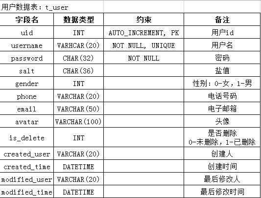

### 1. 项目分析

在开发一个项目之前，应该先分析这个项目中需要处理哪些类型的数据，例如本项目中可能涉及的数据有：商品、商品类别、用户、收藏、订单、购物车、收货地址。

然后，需要为以上数据的相关开发，设计一套开发顺序，即先开发哪种数据的管理功能，后开发哪些，一般来说，应该先开发简单熟悉的，且是基础数据，所以，开发顺序应该是：用户 > 收货地址 > 商品类别 > 商品 > 收藏 > 购物车 > 订单。

接下来，找出第1个要开发的数据，也就是以上分析的“用户”，规划这种数据对应的功能，关于“用户”数据的管理，涉及功能可能有：登录、注册、头像、改密、资料。

然后，再设计以上功能的开发顺序，应该先开发简单熟悉的，通常还遵循增查删改的开发顺序，则以上功能的开发顺序应该是：注册 > 登录 > 改密 > 资料 > 头像。

接下来，就应该可以准备开发了，在开发每种数据的第1个功能之前，还需要先创建这种数据对应的数据表，然后，在项目中创建这张表对应的实体类，然后再开始开发功能，而功能的开发顺序又应该是：持久层 > 业务层 > 控制器 > 前端页面。

### 2. 用户-创建数据表

由于这是项目中的第1个数据表，在创建之前，应该先创建数据库：

	CREATE DATABASE tedu_store;

并使用这个数据库：

	USE tedu_store;

然后，创建数据表，关于数据表的设计：

### 3. 用户-创建实体类

### 4. 用户-注册-持久层

### 5. 用户-注册-业务层

### 6. 用户-注册-控制器

### 7. 用户-注册-前端页面

### 8. 用户-登录-持久层

### 9. 用户-登录-业务层

### 10. 用户-登录-控制器

### 11. 用户-登录-前端页面

